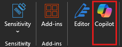
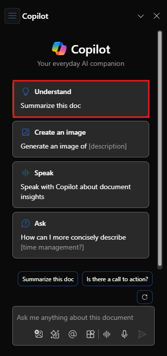

# Simplify and extract key information with Copilot in Word

To start using Microsoft 365 Copilot in Word, you can open the **Copilot** pane by selecting the Copilot icon in the ribbon's **Home** tab.

This helpful feature provides answers to questions—broad or specific—about your document. Have a back-and-forth discussion to iterate and refine your results, get a summary or specific information about the document content, or ask it to generate ideas, tables, or lists that you can copy and insert into your document.

In the following example, we turn a basic prompt for Copilot in Word into a well-constructed, contextual prompt that gives you just what you need, in just the way you need it.

## Let's get crafting

First, download **_[Market Analysis Report for Mystic Spice Premium Chai Tea.docx](https://go.microsoft.com/fwlink/?linkid=2268826)_** and save the file to your **OneDrive folder** if you haven't yet done so.

Open the document in Word and then open the **Copilot** pane by selecting the Copilot icon in the ribbon's **Home** tab. Enter the prompts below and follow along.

> [!NOTE]
> Starting prompt:
>
> _Summarize this Word document._

In this simple prompt, you start with the basic **Goal**: _to summarize a Word document._ However, there's no information about why the document needs to be summarized or what the summary is needed for.

| Element | Example |
| :------ | :------- |
| **Basic prompt:** Start with a **Goal** | **Summarize this Word document.** |
| **Good prompt:** Add **Context** | Adding **Context** can help Copilot understand the purpose of the summary and tailor the response accordingly. _"with a brief overview of the main points to discuss with my team during tomorrow's Sales meeting."_ |
| **Better prompt:** Specify **Source(s)** | Adding **Sources** can help Copilot understand which document or part needs to be summarized and provide a more accurate response. _"...the section on Competitive Analysis..."_ |
| **Best prompt:** Set clear **Expectations** | Lastly, adding **Expectations** can help Copilot understand how to format the summary and what level of detail is required. _"Please keep the summary to 5 key points and use simple language."_ |

> [!NOTE]
> **Crafted prompt**:
>
> _Summarize the section on Competitive Analysis in this Word document with a brief overview of the main points to discuss with my team during the tomorrow's Sales meeting. Please keep the summary to 5 key points and use simple language._

This prompt has all the details it needs - **Goal**, **Context**, **Source**, and **Expectations** - so Copilot can give you the answer you're looking for.

## Explore more

Try out the final prompt we crafted, but using your own Word document. Customize the **Context**, **Sources**, and **Expectations** so that you get what you need from the document, without any extra stuff you don't.

What are some other ways you can think of to add context or sources or expectations to your prompt? Can you think of other prompting strategies you could use to generate the desired response?

> [!IMPORTANT]
> This feature is available to customers with a Microsoft 365 Copilot license or Copilot Pro license. For more information, see [Welcome to Copilot in Word](https://support.microsoft.com/office/welcome-to-copilot-in-word-2135e85f-a467-463b-b2f0-c51a46d625d1).

In the next unit, we'll look at how to craft similar prompts for Copilot in PowerPoint.
