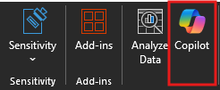
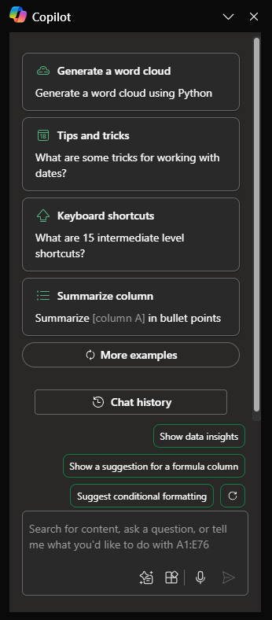

# Spot trends and visualize data with Copilot in Excel

Microsoft 365 Copilot in Excel helps you do more with your data in Excel tables by generating formula column suggestions, showing insights in charts and PivotTables, and highlighting interesting portions of data.

In Excel, select **Copilot** on the ribbon to open the chat pane.

To use Copilot in Excel, your data will need to be formatted in one of the following ways:

- As an Excel Table
- As a support Range

You can create a table, or you can convert a range of cells into a table if you have a data range by following these steps:

1. Select the cell or the range in the data.

1. Select **Home > Format as Table**.

1. In the **Format as Table** dialog box, select the checkbox next to **My table has headers** if you want the first row of the range to be the header row.

1. Select **OK**.

If you prefer to keep your data in a range and not convert it to a table, it will need to meet all of the following requirements:

- Only one header row
- Headers are only on columns, not on rows
- Headers are unique; no duplicate headers
- No blank headers
- Data is formatted in a consistent way
- No subtotals
- No empty rows or columns
- No merged cells

In the following example, we begin with a basic request to analyze a table and progressively add elements to make the prompt more robust.

## Let's get crafting

First, download **_[Contoso Chai Tea market trends 2023.xlsx](https://go.microsoft.com/fwlink/?linkid=2268822)_** and save the file to your **OneDrive folder** if you haven't yet done so.

Open the spreadsheet in Excel and then open the **Copilot** pane by selecting the Copilot icon in the ribbon's **Home** tab. Enter the prompts below and follow along.

> [!NOTE]
> Starting prompt:
>
> _Analyze this table in Excel._

In this simple prompt, you start with the basic **Goal**: _to analyze an Excel table._ However, there's no information about why the table needs to be summarized or what the summary is needed for.

| Element | Example |
| :------ | :------- |
| **Basic prompt:** Start with a **Goal** | **Analyze this table in Excel.** |
| **Good prompt:** Add **Context** | Adding **Context** can help Copilot understand the purpose of the analysis and adjust the response accordingly. _"We're looking for the top-selling products from May through August for artisanal chai sales or premade chai sales."_ |
| **Better prompt:** Specify **Source(s)** | Adding **Sources** can help Copilot narrow down the scope by telling it to use specific information or ranges. _"...from May through August for artisanal chai sales or premade chai sales...."_ |
| **Best prompt:** Set clear **Expectations** | Lastly, adding **Expectations** can help Copilot understand how to format the summary and what level of detail is required. _"Please summarize the top-selling product for each month."_ |

> [!NOTE]
> **Crafted prompt**:
>
> _Analyze this table in Excel. We're looking for the top selling products from May through August for artisanal chai sales or premade chai sales. Please summarize the top selling product for each month._

This prompt gives Copilot everything it needs to come up with a good answer, including the **Goal**, **Context**, **Source**, and **Expectations**.

## Explore more

Try out the final crafted prompt and others with your own Excel table. Here are some suggestions for prompts you might want to try. Copy them and add **Context**, **Sources**, and **Expectations**.  

- Plot sales by category over time.

- Show total sales for each product.

- Show the total of advertising sales for each region last year.

> [!IMPORTANT]
> This feature is available to customers with a Microsoft 365 Copilot license or Copilot Pro license. To learn more about Excel tables and how to create them, see [Create a table in Excel](https://support.microsoft.com/office/bf0ce08b-d012-42ec-8ecf-a2259c9faf3f).
