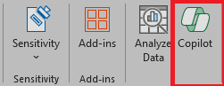
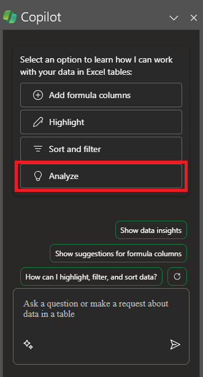
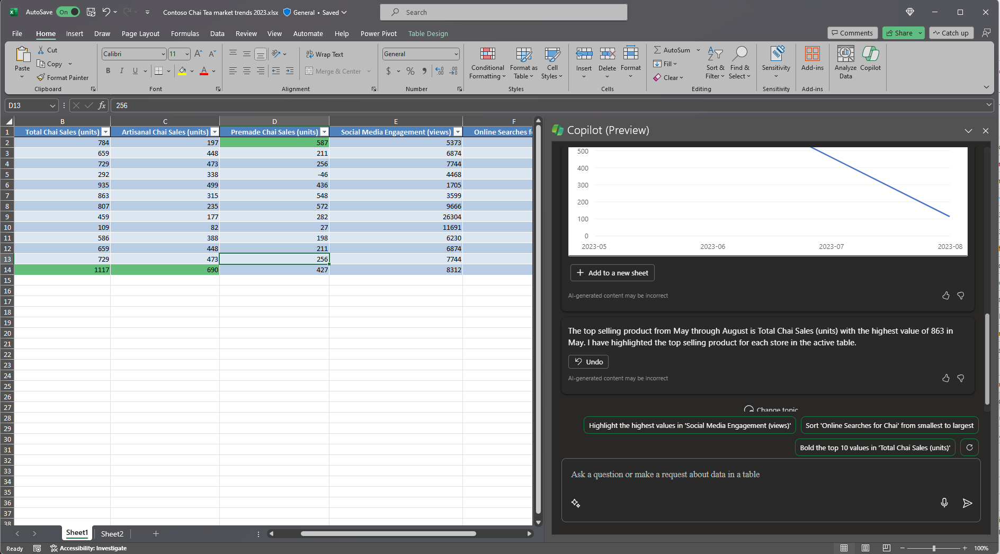

Microsoft 365 Copilot in Excel helps you do more with your data in Excel tables by generating formula column suggestions, showing insights in charts and PivotTables, and highlighting interesting portions of data. 

In Excel, select **Copilot** on the ribbon to open the chat pane. You need to have an **Excel table** that includes data in a worksheet before using Copilot. 

Quickly turn a range of cells into an Excel table by following these steps: 

1. Select the cell or the range in the data.

1. Select **Home > Format as Table**.

1. In the **Format as Table** dialog box, select the checkbox next to **My table has headers** if you want the first row of the range to be the header row.

1. Select **OK**.

## Let's get crafting

First, download **_[Contoso Chai Tea market trends 2023.xlsx](https://go.microsoft.com/fwlink/?linkid=2268822)_** and save the file to your **OneDrive folder** if you haven't yet done so.

Open the spreadsheet in Excel and then open the **Copilot** pane by selecting the Copilot icon in the ribbon's **Home** tab. Enter the prompts below and follow along.

> [!NOTE]
> Starting prompt:
>
> _Analyze this table in Excel._

In this simple prompt, you start with the basic **Goal**: _to analyze an Excel table._ However, there's no information about why the table needs to be summarized or what the summary is needed for.

| Element | Example |
| :------ | :------- |
| Basic prompt:  Start with a **Goal** | **Analyze this table in Excel.** |
| Good prompt:  Add **Context** | Adding **Context** can help Copilot understand the purpose of the analysis and adjust the response accordingly.  "_We're looking for the top selling products from May through August to inform our marketing strategy for next year._" |
| Better prompt:  Specify **Source(s)** | Adding **Sources** can help Copilot narrow down the scope by telling it to use specific information or ranges.  "_...from May through August..._" |
| Best prompt:  Set clear **Expectations** | Lastly, adding **Expectations** can help Copilot understand how to format the summary and what level of detail is required.  "_Please highlight the top selling product month over month._" |

> [!NOTE]
> **Crafted prompt**:
>
> _Analyze this Excel table. We're looking for the top selling products from May through August to inform our marketing strategy for next year. Please highlight the top selling product month over month._

This prompt gives Copilot everything it needs to come up with a good answer, including the **Goal**, **Context**, **Source**, and **Expectations**.

## Explore more

Try out the final crafted prompt and others with your own Excel table. Here are some suggestions for prompts you might want to try. Copy them and add **Context**, **Sources**, and **Expectations**.  

- Plot sales by category over time.

- Show total sales for each product.

- Show the total of advertising sales for each region last year.

> [!IMPORTANT]
> This feature is available to customers with a Copilot for Microsoft 365 license or Copilot Pro license. To learn more about Excel tables and how to create them, see [Create a table in Excel](https://support.microsoft.com/office/bf0ce08b-d012-42ec-8ecf-a2259c9faf3f). 