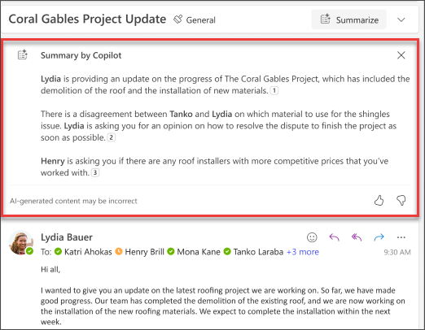

Copilot in Outlook makes inbox management easier with AI-powered assistance to help you write emails quickly and turn long email threads into short summaries. It combines the power of large language models (LLMs) with Outlook data to help you stay productive in the workplace. It can summarize email threads (also known as conversations), pulling out key points from multiple messages.

When **Summary by Copilot** is selected within the context of an email, Copilot automatically provides a summary based on the thread. Common use cases are summarizing a long email to see what decisions have been made and what actions have been suggested by others on the thread.

Once completed, the summary appears at the top of the email and will also include numbered citations that, when selected, takes you to the corresponding email in the thread.

## Let's get crafting

Instead of using the basic summarize feature, open the Copilot pane in Outlook from the toolbar and follow the prompts. However, the specific circumstances of your email will vary, you will need to adapt the prompt to your situation.

> [!NOTE]
> Starting prompt:
>
> _Summarize this email conversation._

In this simple prompt, you start with the basic **Goal**: _to summarize an email conversation._ However, there's no information about why you need the summary or what you're looking for.

| Element | Example |
| :------ | :------- |
| Basic prompt:  Start with a **Goal** | **Summarize this email conversation.** |
| Good prompt:  Add **Context** | Adding **Context** can help Copilot understand the purpose and adjust the response accordingly.  "_I need a brief overview of the action items assigned to me..._" |
| Better prompt:  Specify **Source(s)** | Adding **Sources** can help Copilot understand which part needs to be summarized and provide a more accurate response.  "_...from the project plan that was sent on Thursday._" |
| Best prompt:  Set clear **Expectations** | Lastly, adding **Expectations** can help Copilot understand how to format the summary and what level of detail is required.  "_Create a table containing all of the action items and assigned owners and highlight the items assigned to me._" |

> [!NOTE]
> **Crafted prompt**:
>
> _Summarize this email conversation. I need a brief overview of the action items assigned to me from the project plan that was sent on Thursday. Create a table containing all of the action items and assigned owners and highlight the items assigned to me._

In this prompt, Copilot has all the information it needs to give you a solid answer, thanks to the **Goal**, **Context**, **Source**, and **Expectations** in this prompt. 

> [!IMPORTANT]
> Copilot in Outlook only supports work or school accounts, and Microsoft accounts using outlook.com, hotmail.com, live.com, and msn.com email addresses at this time. Any Microsoft account using an account from a third-party email provider, such as a Gmail, Yahoo, or iCloud, can still use Outlook, but won’t have access to the Copilot features in Outlook. For more information, see [Summarize an email thread with Copilot in Outlook](https://support.microsoft.com/office/summarize-an-email-thread-with-copilot-in-outlook-a79873f2-396b-46dc-b852-7fe5947ab640)