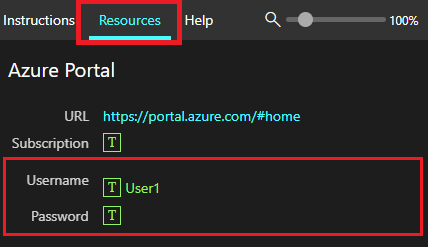

Throughout this module, we'll be crafting prompts for Microsoft 365 Copilot that reference the following files:

- [Contoso CipherGuard Product Specification.docx](https://go.microsoft.com/fwlink/?linkid=2269123)
- [Contoso CipherGuard project plan.docx](https://go.microsoft.com/fwlink/?linkid=2268924)
- [Market Trend Report- Protein shake.docx](https://go.microsoft.com/fwlink/?linkid=2268827)

**Note**: These are the files we’ll reference throughout the module. For this lab, however, we’ll start by uploading all files to **OneDrive** to ensure they’re accessible for Copilot prompts later on.

### Uploading Files to OneDrive

Follow the steps below to upload all files needed to **OneDrive**:

1. Log into the virtual machine provided by your tenant provider as the local **Administrator** account with the password `Pa55w.rd`.
2. In the Windows taskbar, select **Microsoft Edge**.
3. In the address bar, enter `https://www.office.com`.
4. Under **Welcome to Microsoft 365**, select **Sign in**.
5. At the **Sign-in prompt**, enter `userx@yourtenant.onmicrosoft.com` (username and tenant provided by your tenant provided) and select **Next**.

    
    
6. At the **Enter password** screen, enter the password (provided by tenant provider) for the User account, then select **Sign in**.
7. If prompted to **Stay signed in**, select **Don't show this again** and then **Yes**.
8. In **Microsoft 365**, select **Apps**.
9. Within **Apps**, select **OneDrive**.
10. In **OneDrive**, in the top-left corner, select **+** (add new) > **File upload**.
11. In **File Explorer**, select **This PC** > **Local Disk (C:)** and open the **ResourceFiles** folder.
12. Select all files within the **ResourceFiles** folder, then select **Open** to upload them to **OneDrive**.
13. When the upload is complete, you should see **Uploaded 29 items to My files** in the bottom center of the screen.
14. Leave **Edge** open and move on to the next task.

### Referencing Files in Copilot

When using Copilot, you may find that some files aren’t immediately available in the suggestions. This occurs because certain Copilot experiences only reference files from the **Most Recently Used (MRU)** list, while others let you browse **OneDrive** directly. To ensure a file appears in the **MRU** list, simply open it in the relevant Microsoft 365 app, and it will be added automatically.

> [!IMPORTANT]
> Microsoft 365 Copilot can only work with files saved to **OneDrive**. Files stored locally on your PC will need to be moved to **OneDrive** for Copilot to access them.

As you progress through the module, you’ll have opportunities to try various prompts on these files. Feel free to experiment with different approaches to enhance your skills with Copilot.