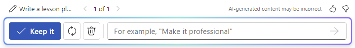

# Draft cover letters, marketing plans, and outlines with Microsoft 365 Copilot in Word

To start using Microsoft 365 Copilot  in Word, you can open the **Copilot** pane by selecting the Copilot icon in the ribbon's **Home** tab or start writing right within the document.

To begin drafting right in the body of the document:

1. Open Microsoft Word and start a new blank document.

1. Type or paste your prompt into the **Draft with Copilot** box.

1. Select **Generate**, and Copilot drafts new content for you.

Once Copilot generates content, select **Keep it** to keep the content, **Regenerate** to regenerate a response, **Discard** to discard the content, or fine tune the draft by entering details into the compose box, like "_Make it more concise_."

In the following example, we turn a basic prompt for Copilot in Word into a well-constructed, contextual prompt that gives you just what you need, in just the way you need it.

## Let's get crafting

First, download **_[Contoso CipherGuard Product Specification.docx](https://go.microsoft.com/fwlink/?linkid=2269123)_** and save the file to your **OneDrive folder** if you haven't yet done so.

Open the document in Word and then open the **Copilot** pane by selecting the Copilot icon in the ribbon's **Home** tab. Enter the prompts below and follow along.

> [!NOTE]
> Starting prompt:
>
> _Draft a marketing proposal._

In this simple prompt, you start with the basic **Goal**: _to create a new marketing proposal._ However, there's no information about what the proposal is funding or who is involved.

| Element | Example |
| :------ | :------- |
| **Basic prompt:** Start with a **Goal** | **_Draft a marketing proposal._** |
| **Good prompt:** Add **Context** | Adding **Context** can help Copilot understand what kind of document you want to create and what it will be used for. _"...for Contoso's latest product: CipherGuard. We need to generate three ideas for a marketing campaign..."_ |
| **Better prompt:** Specify **Source(s)** | Adding **Sources** can help Copilot know where to look for specific information. _"...using the product specifications and requirements."_ |
| **Best prompt:** Set clear **Expectations** | Lastly, adding **Expectations** can help Copilot understand how you want the document to be written and formatted. _"Please include a brief overview of the product, pros and cons for each idea, and ROI projection. Please keep the document to two pages and use optimistic and convincing language."_ |

> [!NOTE]
> **Crafted prompt**:
>
> _Draft a marketing proposal for Contoso's latest product: CipherGuard. We need to generate three ideas for a marketing campaign using the product specifications and requirements. Please include a brief overview of the product, pros and cons for each idea, and ROI projection. Please keep the document to two pages and use optimistic and convincing language._

Review the results of your prompt and follow up with any questions or refinements, then add it to the end of the document in a new section. **Save** the file so it can be used later.

This prompt gives Copilot everything it needs to come up with a good answer, including the **Goal**, **Context**, **Source**, and **Expectations**.

### Referencing sources

If you want Copilot to base your new document off a file you already have, you can tell it to do that. In the **Draft with Copilot** dialog, select **Reference a file** to choose **_up to 3 files_** that Copilot should look at when creating your new document.

In the compose box, you can also enter "/" and the name of the file you'd like to reference, which updates the file options shown in the menu for selection.

> [!IMPORTANT]
> You must have permission to access the files you're referencing, whether they're located in your organization's SharePoint or OneDrive and can be either Word or PowerPoint files.

## Explore more

Want to give it a try? Use the prompt we crafted with your own documents and presentations. After that, here are some suggestions for other prompts you might want to try.

- _Write an article on the importance of creating work/life balance_.

- _Write a white paper about project management_.

- _Write a job offer letter for a sales position at Contoso. The start date is August 1, and the salary is $60,000 per year plus bonuses_.
