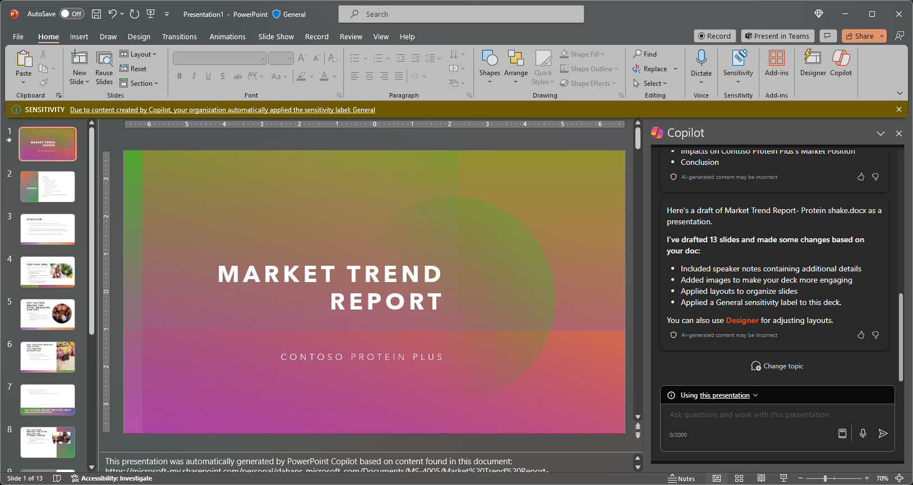

Microsoft Copilot in PowerPoint is an AI-powered feature that can help you create, design, and format your slides.  You can type in what you intend to convey with your presentation, and Copilot helps you get it done. 

Copilot can help you move past that initial blank slide and get you moving in the right direction. To start using Microsoft Copilot in PowerPoint, you can open the **Copilot** pane via the Copilot icon in the ribbon's **Home** tab.

From the Copilot pane, you can begin creating a new presentation from a Word document or about a desired topic. In the example, we start with a basic request to create a presentation about a topic and add other elements to make the prompt more robust.

> [!TIP]
> Currently, Copilot in PowerPoint is only able to create presentations from Word documents.

## Let's get crafting

If you haven't done so yet, download the following files and save the file to your **OneDrive folder** so they appear in your MRU list:

- **_[Market Trend Report- Protein shake.docx](https://go.microsoft.com/fwlink/?linkid=2268827)_**

> [!NOTE]
> Starting prompt:
>
> _Create a new PowerPoint presentation._

In this simple prompt, you start with the basic **Goal**: _to build a new PowerPoint presentation._ However, there's no information about what the presentation is about or what it should look like.

| Element | Example |
| :------ | :------- |
| Basic prompt:  Start with a **Goal** | **_Create a new PowerPoint presentation._** |
| Good prompt:  Add **Context** | Adding **Context** can help Copilot understand what kind of document you want to create and what it will be used for.  "_We need to present the product's features and benefits to potential clients._" |
| Better prompt:  Specify **Source(s)** | Adding **Sources** can help Copilot where to look for specific information.  "_...using the latest from **/Market Trend Report- Protein shake.docx**._" |
| Best prompt:  Set clear **Expectations** | Lastly, adding **Expectations** can help Copilot understand how you want the document to be written and formatted.  "_Please include an overview of the product, its key features and benefits and a comparison to similar products in the market. Please keep the presentation to 10 slides and use simple language._" |

> [!NOTE]
> **Crafted prompt**:
>
> _Create a new PowerPoint presentation using the latest from **/Market Trend Report- Protein shake.docx**. We need to present the product's features and benefits to potential clients. Please include an overview of the product, its key features and benefits, and a comparison to similar products in the market. Please keep the presentation to 10 slides and use simple language._

With the **Goal**, **Context**, **Source**, and **Expectations** all laid out, Copilot has everything it needs to give you a great response.

### Referencing sources

As in the example, if you want Copilot to base your new presentation off a file you already have, you can tell it to do that. In the prompt window, select **Create presentation from file** to choose **_up to 3 files_** that Copilot should look at when creating your new document.

In the compose box, you can also enter "/" and the name of the file you'd like to reference, which will update the file options shown in the menu for selection.

> [!IMPORTANT]
> You must have permission to access the files you're referencing, whether they're located in your organization's SharePoint or OneDrive and can be either Word or PowerPoint files.

### Best practices when creating a presentation from a Word document

Leverage **Word Styles** to help Copilot understand the structure of your document. By using **Styles** in Word to organize your document, Copilot will better understand your document structure and how to break it up into slides of a presentation. Structure your content under **Titles** and **Headers** when appropriate and Copilot will do its best to generate a presentation for you.

### Include images that are relevant to your presentation

When creating a presentation, Copilot will try to incorporate the images in your Word document. If you have images that you would like to be brought over to your presentation, be sure to include them in your Word document.

### Start with your organization’s template

If your organization uses a standard template, start with this file before creating a presentation with Copilot. Starting with a template will let Copilot know that you would like to retain the presentation’s theme and design. Copilot will use existing layouts to build a presentation for you.

> [!IMPORTANT]
> This feature is available to customers with a Copilot for Microsoft 365 license or Copilot Pro license. For more information, see [Create a presentation from a file with Copilot](https://support.microsoft.com/office/create-a-new-presentation-3222ee03-f5a4-4d27-8642-9c387ab4854d).