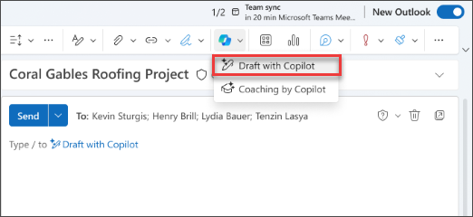
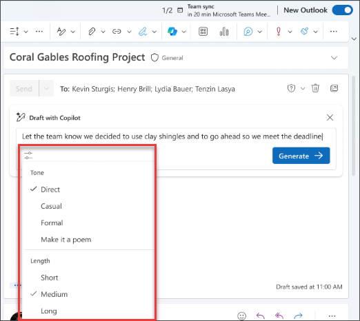

Microsoft 365 Copilot in Outlook makes inbox management easier with AI-powered assistance to help you write emails quickly and turn long email threads into short summaries. It combines the power of large language models (LLMs) with Outlook data to help you stay productive in the workplace. It can summarize email threads (also known as conversations), pulling out key points from multiple messages.

> [!NOTE]
> Drafting in Outlook for Microsoft 365 is currently available in new Outlook for Windows, Outlook on the web, and Outlook.com. If you have classic Outlook, [get new Outlook](https://support.microsoft.com/office/start-using-new-outlook-for-windows-4395454d-cb2f-4c16-bb24-fa4bb36650ae). If you're unable to access, check with your IT admin.

Copilot in Outlook can help you quickly draft an email or a reply to an existing conversation.

1. In Outlook, select **Home > New Mail > Mail**.

1. To start a new message, select the **Copilot icon** from the toolbar.

1. Select **Draft with Copilot** from the drop-down menu.

    

1. In the Copilot box, **type your prompt**.

1. Select **Generate options** to choose your desired length and tone.

    

1. When finished, select **Generate**. Copilot drafts a message for you.

1. Review the message. If it’s not quite what you want, choose **Regenerate draft** and Copilot create a new version.

1. To start over, change your prompt and select **Generate** again.

1. Once satisfied with the result, select **Keep**.

1. Edit the draft as needed, and then select **Send**.

    

## Let's get crafting

> [!NOTE]
> Starting prompt:
>
> _Draft a new email._

In this simple prompt, you start with the basic **Goal**: _to draft a new email._ However, there's no information about what the email will even be about, who to send it to, or what you want it to sound like.

| Element | Example |
| :------ | :------- |
| Basic prompt:  Start with a **Goal** | **_Draft a new email._** |
| Good prompt:  Add **Context** | Adding **Context** can help Copilot understand what the email should be about and who the audience is.  "_...to my client, Allan Deyoung, regarding the status of their support ticket._" |
| Better prompt:  Specify **Source(s)** | Adding **Sources** can help Copilot where to look for specific information.  "_...Look through my emails for latest information on ticket #1928374655._" |
| Best prompt:  Set clear **Expectations** | Lastly, adding **Expectations** can help Copilot understand how you want the document to be written and formatted.  "_The email should sound professional and technical, but written with empathy._" |

> [!NOTE]
> **Crafted prompt**:
>
> _Draft a new email to my client, Allan Deyoung, regarding the status of their support ticket. Look through my emails for the latest information on ticket #1928374655. The email should sound professional and technical, but written with empathy._

In this prompt, Copilot has all the information it needs to give you a solid answer, thanks to the **Goal**, **Context**, **Source**, and **Expectations** in this prompt. 

> [!IMPORTANT]
> Copilot in Outlook only supports work or school accounts, and Microsoft accounts using outlook.com, hotmail.com, live.com, and msn.com email addresses at this time. Any Microsoft account using an account from a third-party email provider, such as a Gmail, Yahoo, or iCloud, can still use Outlook, but won’t have access to the Copilot features in Outlook. For more information, see [Draft an email message with Copilot in Outlook](https://support.microsoft.com/office/draft-an-email-message-with-copilot-in-outlook-3eb1d053-89b8-491c-8a6e-746015238d9b).