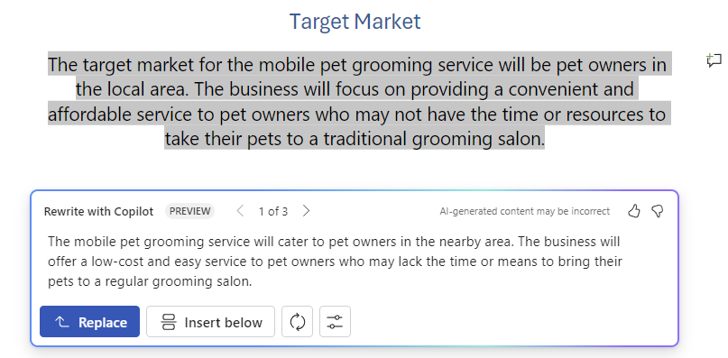
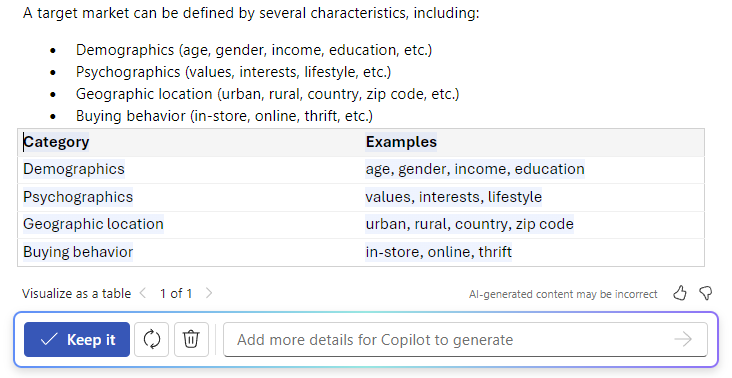
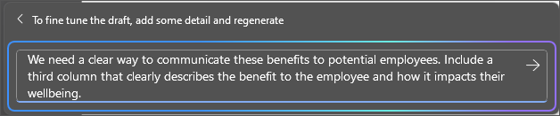
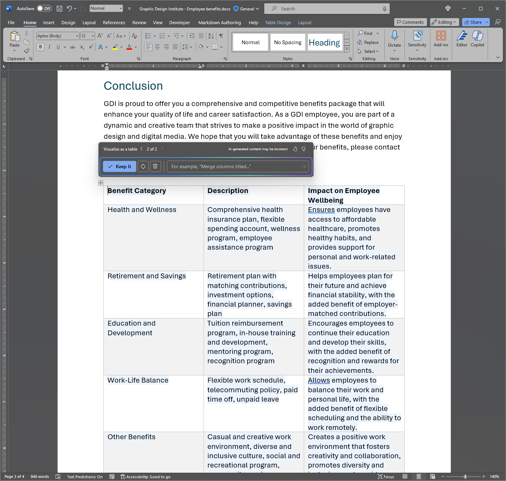

Microsoft 365 Copilot in Word allows you to stay in the flow of ideas while drafting new content and transform your content once you have your ideas written. Copilot can rewrite your text, including adjustments for tone. Copilot can also transform your text into an editable table. Follow the steps to transform your content in Word:

## Rewrite for tone

1. Select the text you want Copilot to rewrite.

1. In the left margin next to your text, select the **Copilot icon**.

1. From the left margin Copilot menu, select **Rewrite**.

1. Copilot shows you rewritten options to choose from.

1. Select **Replace** to use the revised text, **Insert below** to insert the rewritten text below the current text, **Regenerate** to regenerate Copilot's suggestions, or **Adjust tone** to adjust the rewritten text for desired tone.

    

## Text to table

1. Select the text you want Copilot to turn into a table.

1. In the left margin next to your text, select the **Copilot** icon.

1. From the left margin Copilot menu, select **Visualize as a table**.

1. Copilot shows you what the table looks like.

1. Select **Keep it** to insert the table into your document, **Regenerate** to regenerate Copilot's table, or **Discard** to remove the table.

1. To fine tune the table, enter details into the Copilot compose box to state what to change about the table.

    1. Changing a table's formatting isn't supported using the compose box, but the table's formatting can be changed by using the table options in the Word ribbon.

    

In the following example, we start with a simple prompt to turn some text into a table and add elements along the way. Follow along with the example using your own data.

## Let's get crafting

First, download **_[Graphic Design Institute - Employee Benefits.docx](https://go.microsoft.com/fwlink/?linkid=2268825)_** and save the file to your **OneDrive folder** if you haven't yet done so.

Open the document in Word and highlight all the text in the document (press **Ctrl-A**). From the left margin Copilot menu, select **Visualize as a table**. After generating the table, follow up with Copilot using the prompts below to refine your results.

> [!NOTE]
> Starting prompt:
>
> _Visualize as a table._

In this simple prompt, you start with the basic **Goal**: _to transform text into a table._ However, there's no indication what information you want in the table or why it should be a table.

| Element | Example |
| :------ | :------- |
| Basic prompt:  Start with a **Goal** | **_Visualize as a table._** |
| Good prompt:  Add **Context** | Adding **Context** can help Copilot understand what kind of data to see and what it will be used for.  "_We need a clear way to communicate these benefits to potential employees._" |
| Better prompt:  Specify **Source(s)** | The **Source** in this example is the entire text of **Graphic Design Institute - Employee Benefits.docx**. |
| Best prompt:  Set clear **Expectations** | Lastly, adding **Expectations** can help Copilot understand how you want the table organized and written.  "_Include a third column that clearly describes the benefit to the employee and how it impacts their wellbeing._" |

> [!NOTE]
> **Crafted prompt**:
>
> _Visualize as a table. We need a clear way to communicate these benefits to potential employees. Include a third column that clearly describes the benefit to the employee and how it impacts their wellbeing._

This prompt gives Copilot everything it needs to come up with a good answer, including the **Goal**, **Context**, **Source**, and **Expectations**.

> [!Important]
> This feature is available to customers with a Microsoft 365 Copilot license or Copilot Pro license. For more information, see [Transform your content with Copilot in Word](https://support.microsoft.com/office/transform-your-content-with-copilot-in-word-923d9763-f896-4da7-8a3f-5b12c3bfc475).