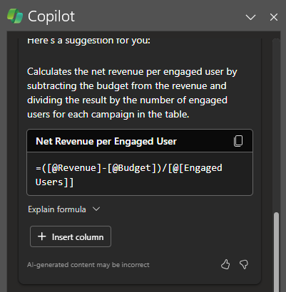
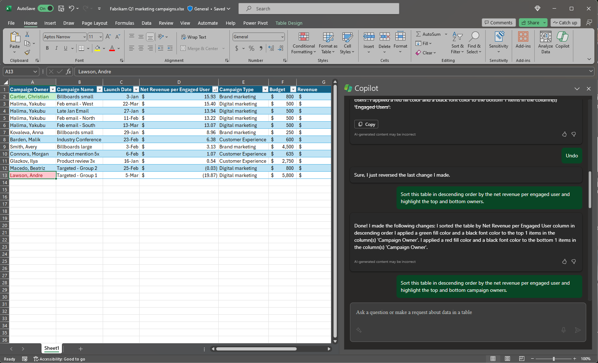

With Microsoft 365 Copilot in Excel, it's easy to highlight, sort, and filter your tables to quickly call attention to what matters to you. Using a single table in Excel, you can have Copilot effortlessly: 

- Sort and filter your data.

- Apply simple conditional formatting.

To get started, format your data as a table and select the **Copilot** icon in the ribbon. Then, tell Copilot how you'd like to manipulate the table to better view portions of your data. 

In the following example, we start with a simple prompt and add elements along the way. Follow along with the example using your own data.

## Let's get crafting

First, download **_[Fabrikam Q1 marketing campaigns.xlsx](https://go.microsoft.com/fwlink/?linkid=2269124)_** and save the file to your **OneDrive folder** if you haven't yet done so.

Open the spreadsheet in Excel and then open the **Copilot** pane by selecting the Copilot icon in the ribbon's **Home** tab. Enter the prompts below and follow along.

> [!NOTE]
> Starting prompt:
>
> _Sort this table._

In this simple prompt, you start with the basic **Goal**: _to sort and filter an Excel table_. However, there's no indication how you want the data sorted and which field you want to filter.

| Element | Example |
| :------ | :------- |
| Basic prompt:  Start with a **Goal** | **_Sort this table..._** |
| Good prompt:  Add **Context** | Adding **Context** can help Copilot understand what the slides are for and what topic to focus on.  "_...to look for the most impactful salesperson._" |
| Better prompt:  Specify **Source(s)** | The **Source** for this prompt is assumed to be the table we're working with in Excel.  "_...this table [Table1]..._" |
| Best prompt:  Set clear **Expectations** | Lastly, adding **Expectations** can help Copilot understand how you want the table sorted, filtered, and presented.  "_Add a third column that calculates the net revenue per engaged user, taking into account their budget costs. Sort this table in descending order by the net revenue per engaged user and highlight the top and bottom owners._" |

> [!NOTE]
> **Crafted prompt**:
>
> _Sort this table [Table1] to look for the most impactful salesperson. Add a third column that calculates the net revenue per engaged user, taking into account their budget costs. Sort this table in descending order by the net revenue per engaged user and highlight the top and bottom owners._

This prompt requires multiple steps to execute, a prompting technique called **chaining** where you ask Copilot to perform sequential, back-to-back commands to achieve a single goal. 

In the crafted prompt, Copilot understands it first needs to come up with a formula for the new column to calculate net revenue per engaged user and insert it into the table.

Now that the new column has been inserted into the table, you can ask Copilot sort the table by highest net revenue per engaged user, as well as highlight the top and bottom sellers.

Copilot has all the info it needs to give you a solid answer, thanks to the **Goal**, **Context**, **Source**, and **Expectations** in this prompt.

## Explore more

Try out these simple prompts to highlight, sort, and filters your data and add other elements to improve your results:

- Bold the top 10 values in the Sales column.

- Highlight the highest values in Units Sold.

- Sort engagement rate from smallest to largest.  

- Filter to items that are due next week.

> [!IMPORTANT]
> Copilot will only work on files that are stored on OneDrive or SharePoint. If you can’t select the Copilot button in the ribbon, try saving the file to the cloud first. For more information, see [Highlight, sort, and filter your data with Copilot in Excel](https://support.microsoft.com/office/highlight-sort-and-filter-your-data-with-copilot-in-excel-05302e3f-de42-4475-b235-be9cb3d4e936).