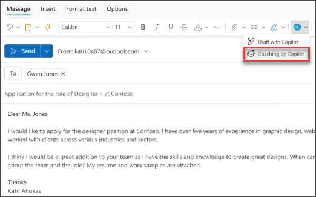
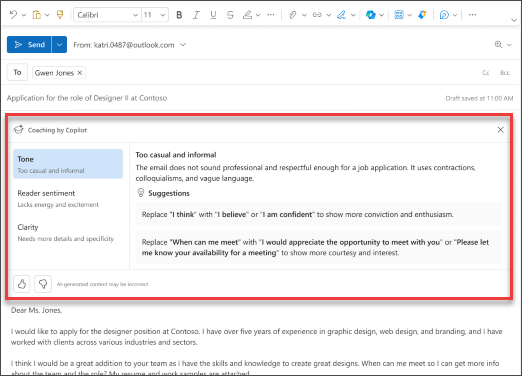

Have an important email to write and want to feel confident that it effectively conveys your intended message? With Copilot in Outlook, you can get helpful suggestions on how to adjust the tone, clarity, and reader sentiment before you hit send. 

1. In Outlook, select **Home > New Mail > Mail**. Type your email message. 

1. Select the **Copilot** icon from the toolbar. Choose **Coaching by Copilot** from the drop-down menu.

    

1. Copilot reviews your email and offer suggestions on improving the tone, clarity, and reader sentiment.

1. If you like any or all of the suggestions, incorporate the feedback into the draft. When you're satisfied, send your email.

    

In the following example, we start with a simple prompt and add elements along the way. Follow along with the example using your own email.

## Let's get crafting

> [!NOTE]
> Starting prompt:
>
> _Review this email and make suggestions to improve it._

In this simple prompt, you start with the basic **Goal**: _to review an email for improvements_. As you can see though, there isn't much information to start with.

| Element | Example |
| :------ | :------- |
| Basic prompt:  Start with a **Goal** | **_Review this email and make suggestions to improve it_**. |
| Good prompt:  Add **Context** | Adding **Context** can help Copilot understand the intention for the email and what improvements you want to see.  "..._to our client and make suggestions to improve its clarity and professionalism_." |
| Better prompt:  Specify **Source(s)** | The **Source** for this prompt is assumed to be the email you're writing in Outlook.  "_...this email_." |
| Best prompt:  Set clear **Expectations** | Lastly, adding **Expectations** can help Copilot understand how you want the table to look and sound.  "_Please suggest changes to the email's subject line, greeting, body text, and closing. Please ensure that the email is concise, free of errors, and uses a professional tone_." |

> [!NOTE]
> **Crafted prompt**:
>
> _Review this email to our client and make suggestions to improve its clarity and professionalism. Please suggest changes to the email's subject line, greeting, body text, and closing. Please ensure that the email is concise, free of errors, and uses a professional tone._

This prompt gives Copilot everything it needs to come up with a good answer, including the **Goal**, **Context**, **Source**, and **Expectations**.

## Explore more

> [!IMPORTANT]
> Coaching with Copilot is currently available in new Outlook for Windows, Outlook on the web, and Outlook.com.
> Copilot in Outlook only supports work or school accounts, and Microsoft accounts using outlook.com, hotmail.com, live.com, and msn.com email addresses at this time. Any Microsoft account using an account from a third-party email provider, such as a Gmail, Yahoo, or iCloud, can still use Outlook, but won’t have access to the Copilot features in Outlook. For more information, see **[Email coaching with Copilot in Outlook](https://support.microsoft.com/office/email-coaching-with-copilot-in-outlook-91a3cd56-1586-4a31-85c7-2eb8cdb02405#OSVersion=iOS)**.