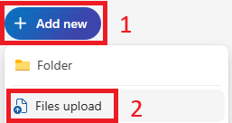

# Exercise - Follow along using sample data with Microsoft 365 Copilot

Throughout this module, we'll be crafting prompts for Microsoft 365 Copilot that reference the following files:

- [Market Analysis Report for Mystic Spice Premium Chai Tea.docx](https://go.microsoft.com/fwlink/?linkid=2268826)
- [Mystic Spice Premium Chai Market Analysis Presentation.pptx](https://go.microsoft.com/fwlink/?linkid=2268768)
- [Mystic Spice Premium Chai Tea product description.docx](https://go.microsoft.com/fwlink/?linkid=2268929)
- [Fabrikam Q1 marketing campaigns.xlsx](https://go.microsoft.com/fwlink/?linkid=2269124)

**Note**: These are the files we’ll reference throughout the module. For this lab, however, we’ll start by uploading all files to **OneDrive** to ensure they’re accessible for Copilot prompts later on.

## Uploading Files to OneDrive

> [!IMPORTANT]
> You may skip this step if you have already uploaded all files from the folder **"C:\ResourceFiles"** to **OneDrive**. 

Follow the steps below to upload all files needed to **OneDrive**:

1. Log into the virtual machine provided by your tenant provider as the local **Administrator** account with the password `Pa55w.rd`.
2. In the Windows taskbar, select **Microsoft Edge**.
3. In the address bar, enter `https://onedrive.live.com/login`.
4. Under **Welcome to Microsoft 365**, select **Sign in**.
5. At the **Sign-in prompt**, enter `userx@yourtenant.onmicrosoft.com` (username and tenant provided by your tenant provided) and select **Next**.

    

6. At the **Enter password** screen, enter the password (provided by tenant provider) for the User account, then select **Sign in**.
7. If prompted to **Stay signed in**, select **Don't show this again** and then **Yes**.
8. In **OneDrive**, in the top-left corner, select **+** (add new) > **File upload**.

    

9. In **File Explorer**, select **This PC** > **Local Disk (C:)** and open the **ResourceFiles** folder.
10. Select all files within the **ResourceFiles** folder, then select **Open** to upload them to **OneDrive**.
11. When the upload is complete, you should see **Uploaded 29 items to My files** in the bottom center of the screen.
12. Leave **Edge** open and move on to the next task.

### Referencing files

When referencing files from Copilot, you might find that you can't find some files from the suggestions provided to you. This happens sometimes because certain experiences with Copilot only reference files from the Most Recently Used (MRU) list, while others let you browse OneDrive to find your file. Adding them to that list is as easy as opening them up in the appropriate Microsoft 365 app.  Once they've been opened, they should appear in the MRU list.

> [!IMPORTANT]
> Microsoft 365 Copilot  will only work with files saved to OneDrive. If files are stored locally on your PC, you will need to move them to OneDrive to activate Copilot.

As you progress through the module, you'll have an opportunity to try out other prompts against these files and are encouraged to do so to explore and enhance your prompting skills.
