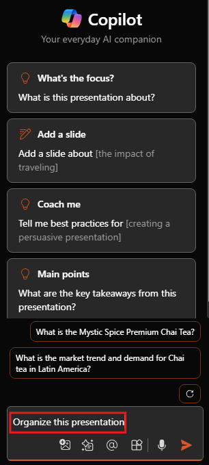

# Get design and organization tips with Microsoft 365 Copilot in PowerPoint

To start chatting with Copilot in PowerPoint, you can open the **Copilot** pane by selecting the Copilot icon in the ribbon's **Home** tab.

As you're creating a presentation, you may be unsure of how to organize your slides into sections. Copilot in PowerPoint can help. You can ask Copilot to organize your presentation. It organizes them into sections, and then adds section heading slides.

1. In the ribbon, select the Copilot button.

1. The Copilot pane opens on the right side of your screen.

1. Type **Organize this presentation** into the prompt field at the bottom of the Copilot pane.

1. Select **Send**.

If you don't like what Copilot does, you can simply select the **Undo button** on the ribbon to restore your deck to its previous state.

## Let's get crafting

If you haven't done so yet, download the following files and save the file to your **OneDrive folder** so they appear in your MRU list:

- **_[Mystic Spice Premium Chai Market Analysis Presentation.pptx](https://go.microsoft.com/fwlink/?linkid=2268768)_**
- **_[Mystic Spice Premium Chai Tea product description.docx](https://go.microsoft.com/fwlink/?linkid=2268929)_**

> [!NOTE]
> Starting prompt:
>
> _Organize this PowerPoint presentation._

In this simple prompt, you start with the basic **Goal**: _to organize a PowerPoint_. However, there's no information about why the presentation needs to be summarized or what the summary is needed for.

| Element | Example |
| :------ | :------- |
| **Basic prompt:** Start with a **Goal** | **Organize this PowerPoint presentation.** |
| **Good prompt:** Add **Context** | Adding **Context** can help Copilot understand the way in which you want to organize the deck and the reason for doing so. _"for an executive product review next week"_ |
| **Better prompt:** Specify **Source(s)** | Adding **Sources** can help Copilot look in a specific location, such as product specifications or a catalog. _"Refer to the **/Mystic Spice Premium Chai Tea product description.docx** for product information."_ |
| **Best prompt:** Set clear **Expectations** | Lastly, adding **Expectations** can help Copilot understand how to structure the presentation and what level of detail to include. _"Arrange the slides by product and include an overview, a list of key features and benefits, customer feedback, and a comparison to similar products in the market."_ |

> [!NOTE]
> **Crafted prompt**:
>
> _Organize this presentation for an executive product review next week. Refer to the **/Mystic Spice Premium Chai Tea product description.docx** for product information. Arrange the slides by product and include an overview, a list of key features and benefits, customer feedback, and a comparison to similar products in the market._

In this prompt, the **Goal**, **Context**, **Source**, and **Expectations** are all provided, giving Copilot enough direction to generate a response that meets your needs.

## Explore more

Try out the final prompt we crafted, but using your own PowerPoint presentation. Customize the **Context**, **Sources**, and **Expectations** so that you get what you need from the presentation, without any extra stuff you don't.

> [!IMPORTANT]
> This feature is available to customers with a Microsoft 365 Copilot license or Copilot Pro license. For more information, see [Organize this presentation with Copilot in PowerPoint](https://support.microsoft.com/office/organize-this-presentation-with-copilot-in-powerpoint-a207eea3-7a56-4225-88f1-54dd37cdcf6a).
