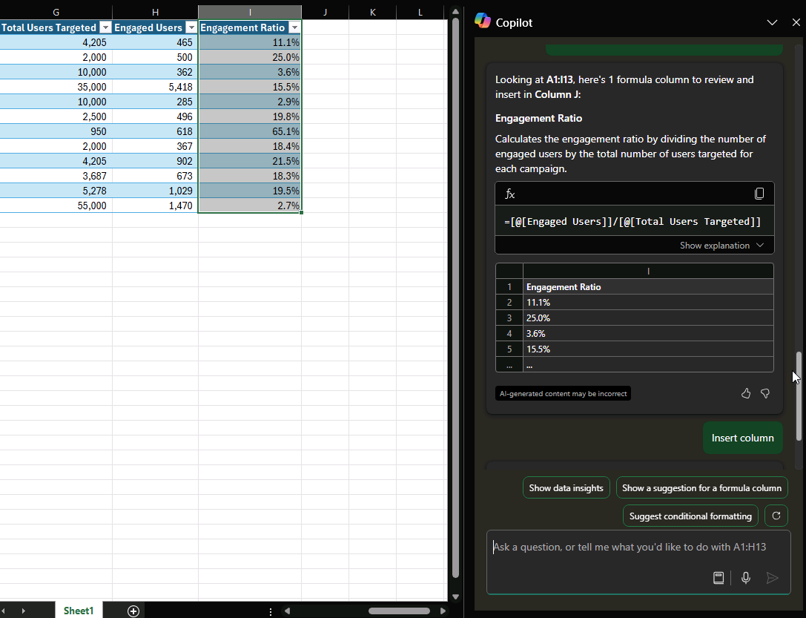

# Analyze and work with tables using Microsoft 365 Copilot in Excel

If you're not sure how to write a formula for a new column, Microsoft 365 Copilot can quickly add new columns with formulas based on your data.

1. With your data formatted as a table, select the **Copilot** button in the ribbon.

1. Select **Add formula columns** or **Show suggestions for formula columns**. You can also describe what columns you’d like to add by typing it in your own words.

1. Copilot provides formula suggestions with an explanation on how each formula works. View the explanation by selecting **Explain formula**.

1. Select Insert column to add the formula column to your table.

> [!IMPORTANT]
> As with any AI-generated content, it’s important to review, edit, and verify anything Copilot creates for you.

## Let's get crafting

First, download **_[Fabrikam Q1 marketing campaigns.xlsx](https://go.microsoft.com/fwlink/?linkid=2269124)_** and save the file to your **OneDrive folder** if you haven't yet done so.

Open the spreadsheet in Excel and then open the **Copilot** pane by selecting the Copilot icon in the ribbon's **Home** tab. Enter the prompts below and follow along.

> [!NOTE]
> Starting prompt:
>
> _Suggest a formula column._

In this simple prompt, you start with the basic **Goal**: _to create a new column with a formula_. However, there isn’t enough detail to determine what the formula should calculate.  

| Element | Example |
| :------ | :------- |
| **Basic prompt:** Start with a **Goal** | **_Suggest a formula column._** |
| **Good prompt:** Add **Context** | Adding **Context** helps Copilot understand what the formula should calculate. _"...for column J to determine the engagement ratio of each campaign."_ |
| **Better prompt:** Specify **Source(s)** | The **Source** for this prompt is the specific columns needed for the calculation. _"...using the values from 'Engaged Users' and 'Total Users Targeted'."_ |
| **Best prompt:** Set clear **Expectations** | Adding **Expectations** helps Copilot structure the formula correctly. _"Ensure the formula divides 'Engaged Users' by 'Total Users Targeted' and formats the result as a percentage."_ |

> [!NOTE]  
> **Crafted prompt:**  
>
> _Suggest a formula for column J to calculate the engagement ratio of each campaign. Use the values from 'Engaged Users' and 'Total Users Targeted'. Ensure the formula divides 'Engaged Users' by 'Total Users Targeted' and formats the result as a percentage._  

Copilot has all the info it needs to give you a solid answer, thanks to the **Goal**, **Context**, **Source**, and **Expectations** in this prompt.

## Explore more

Use these prompts as a starting point. Copy and modify them to suit your needs.

- Calculate total cost per product in a new column.

- Add a column that calculates the total profit for each marketing campaign in 2022.

- Add a column that calculates the number of days after the product launch event.

For more information, see [Generate formula columns with Copilot in Excel](https://support.microsoft.com/office/generate-formula-columns-with-copilot-in-excel-d866d926-9791-4e5f-be2a-c6dd9e587a47).
